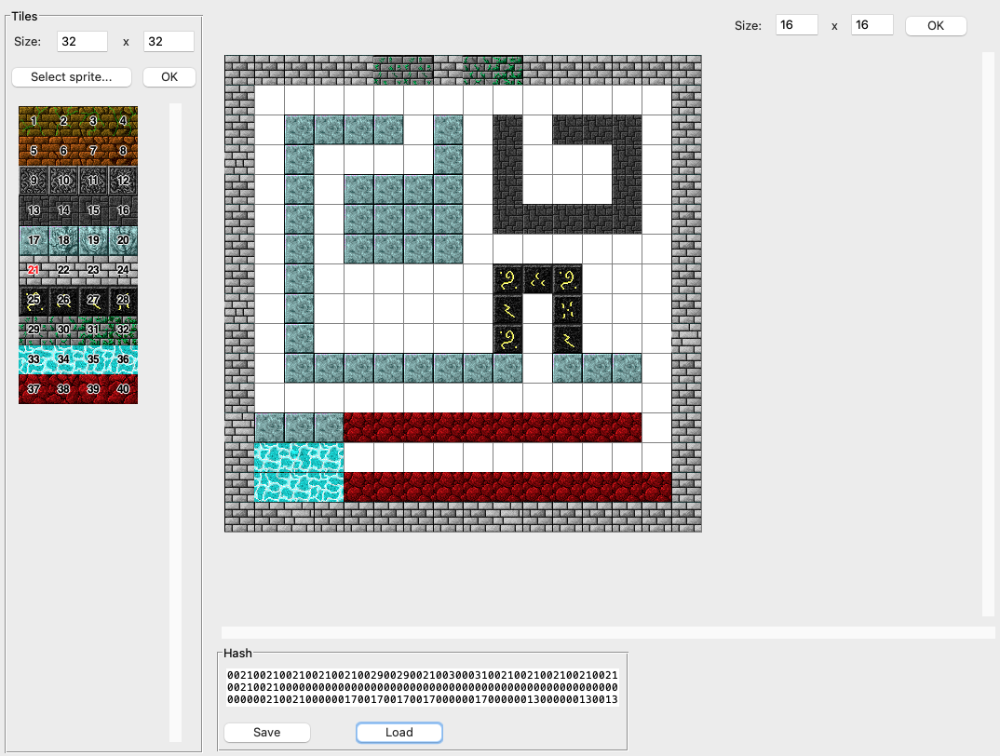
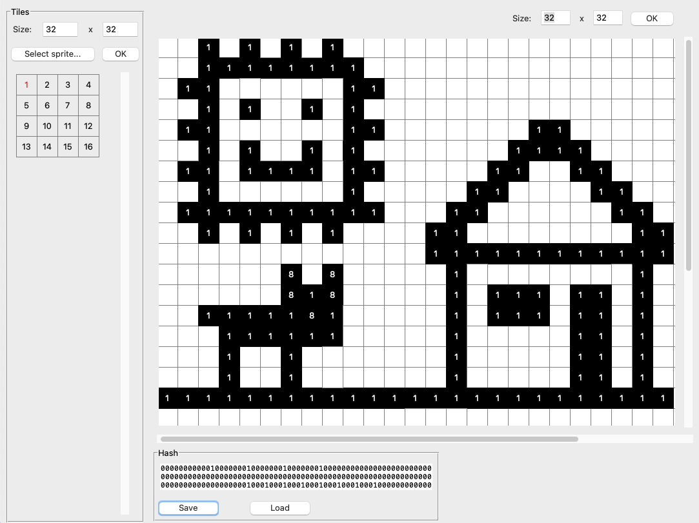

# 2D Games Map Editor

Simple app for designing 2D game maps with square tiles.

While developing a 2D game, I noticed that editing a larger tile-based map directly from code
is a pain... Therefore, I created a simple GUI to simplify this process.
As I rarely use tkinter, the code requires some cleanup, but that's a task for another day.
Currently, the app works fine and allows users to define the map size, upload a tileset image,
specify dimensions for each graphical tile, and draw selected tiles at chosen locations.
Additionally, it offers export and import functionality, allowing maps to be saved and loaded as hash strings.
Each tile is represented by a unique number, with each number stored as a 4-character string in the hash.
It's also possible to design the map without graphical tiles and use only numbers to draw.

Example tiles downloaded from: https://opengameart.org/content/dungeon-crawl-32x32-tiles